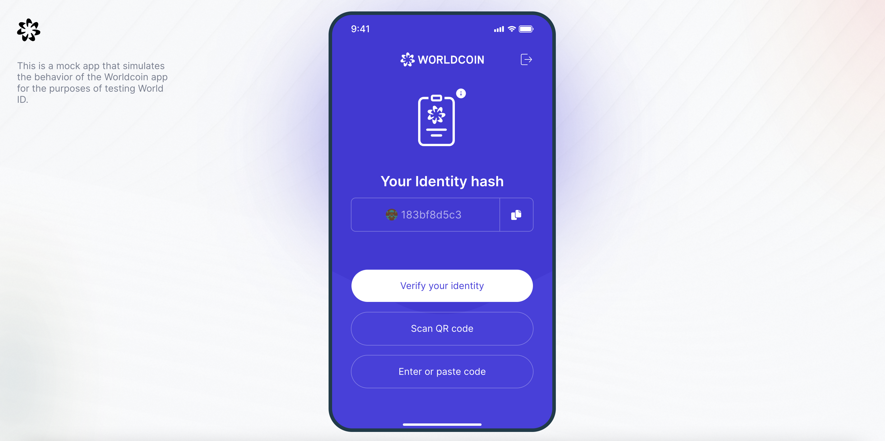
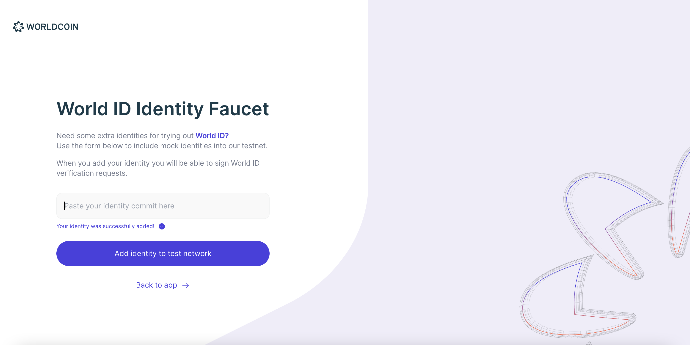

# World ID Mock App

This is a sample verification app that simulates the behavior of the Worldcoin app to use World ID in the [Test network](https://id.worldcoin.org/test). It works together with World ID's [Javascript Integration](https://id.worldcoin.org/docs/js).

- Generates Sempahore identity for signing World ID requests.
- Persistent Sempahore identities can be generated by signing requests with a real ETH wallet (through WalletConnect interaction).
- Add identity to the tree of verified identities with the identity faucet.
- Interact with World ID's [Javascript Integration](https://id.worldcoin.org/docs/js) to receive verification request, generate ZKP and transfer it back.

<p align="center">

</p>

<p align="center">

</p>

<!-- WORLD-ID-SHARED-README-TAG:START - Do not remove or modify this section directly -->
<!-- WORLD-ID-SHARED-README-TAG:END -->

## 🧑‍💻 Development & testing

- Get an Infura project ID from https://infura.io/ and create an `.env` file with it (see [.env.sample](./.env.sample))

- Install dependencies

  ```bash
  npm ci
  ```

- Run app locally

  ```bash
  npm run dev
  ```
